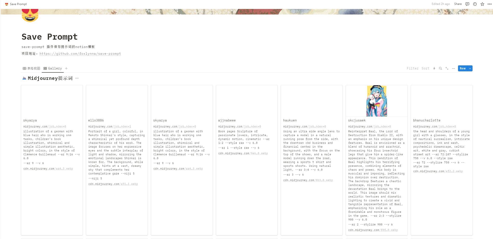
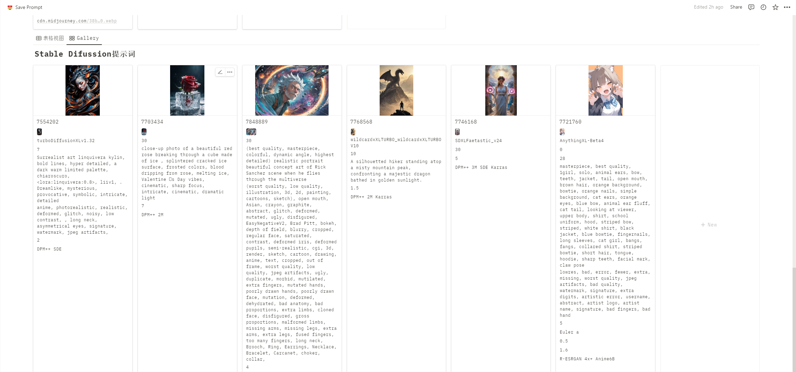
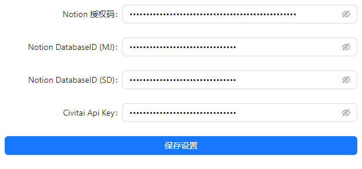
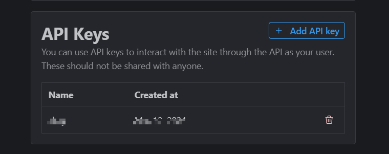
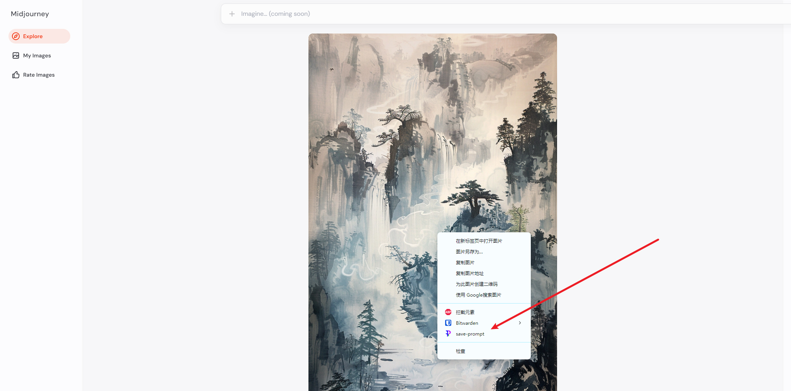
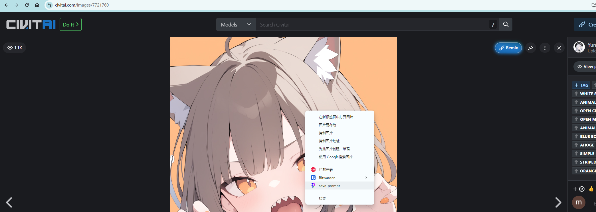

# 将提示词保存到Notion的Chrome插件

  
  

    

- [将提示词保存到Notion的Chrome插件](#将提示词保存到notion的chrome插件)
  - [功能](#功能)
  - [支持范围](#支持范围)
  - [安装与使用](#安装与使用)
    - [安装插件](#安装插件)
      - [获取插件](#获取插件)
      - [安装](#安装)
    - [获取配置](#获取配置)
      - [notion intergration Secrets 申请](#notion-intergration-secrets-申请)
      - [拷贝notion模板](#拷贝notion模板)
      - [连接Notion页面到 intergration](#连接notion页面到-intergration)
      - [获取Notion数据库ID](#获取notion数据库id)
      - [获取 Civitai Api Key （可选）](#获取-civitai-api-key-可选)
    - [使用](#使用)
  - [限制](#限制)
    - [midjourney](#midjourney)
    - [civitai](#civitai)
  - [常见问题](#常见问题)
  - [资源地址](#资源地址)

## 功能
- [Midjourney](https://www.midjourney.com/) 上保存图片提示词等信息；保存信息包括：
  - 发布用户名
  - 原始链接
  - 提示词
  - 提示词参数
  - 图片访问地址
- [C站](https://civitai.com/) 上保存图片提示词等信息；保存信息包括：
  - 图片ID
  - 图片访问地址
  - 模型名称
  - 模型地址
  - 采样步数(steps)
  - 正向提示词
  - 反向提示词
  - CFG
  - 采样器(sampler)
  - 降噪强度(denoisingStrength)
  - 放大倍数(hiresUpscal)
  - 放大器(hiresUpscaler)

notion内截图

**Midjourney部分**

**Stable Diffuison部分**

## 支持范围
- midjourney 网站 ***图片详情页使用***
    - https://www.midjourney.com/explore
    - https://www.midjourney.com/imagine

- C站 ***图片详情页使用***
    - https://civitai.com/

## 安装与使用

视频教程

[BV1Nr421n7V9](https://www.bilibili.com/video/BV1Nr421n7V9/?vd_source=3ea4b8cada48ac13acbca4da8d719890)

### 安装插件

#### 获取插件

1. clone 项目自己打包；

   [README_Starter.md]: ./README_Starter.md

2. 从 本项目 *releases*，下载 *dist.zip*。

#### 安装

解压后，打开Chrome扩展程序页面，右上角开启开发者模式。

加载已解压的扩展程序，选择解压后的 *dist* 目录。

注意目录结构应为：

- dist
  - js
  - 其他文件

安装后从*扩展工具栏* 中点击此扩展：

填入配置信息（获取配置信息见下文），**点击保存设置**

### 获取配置

#### notion intergration Secrets 申请

从页面上申请：https://www.notion.so/my-integrations

步骤：Create new intergration -> 填写信息 -->提交

生成后 复制 **Secrets** 到插件 ***Notion 授权码*** 一栏，点击保存

#### 拷贝notion模板

[模板地址](https://mikotoayu.notion.site/Save-Prompt-template-835950fa263147bda2a2876d2c824f83)

点击模板地址中右上角 **Duplicate**

**保存**到自己账户下后出现在左侧栏如下

#### 连接Notion页面到 intergration 

选中页面右上角三点  --> Connction to --> 选择刚才 构建 intergration 时自己填写的名称。这样就链接上了。

#### 获取Notion数据库ID

**点击** *Midjourney提示词* 页面，有两种方式获取数据库ID

1. 从当前页面的*url*中获取：`https://www.notion.so/username/ba64c7fbb5eb43f4a822b34d081674dx?v=d72a46a9679746a1b9428b6d991f720x`

其中你的用户名后面跟的字符串就是：`ba64c7fbb5eb43f4a822b34d081674dx`

2. **点击** *Midjourney提示词*页面后，点击右上角 Share -> Publish，从链接地址获取

***同理可获取 notion Stable Diffusion页面 数据库的 ID***

分别配置到扩展：

- Notion DatabaseID (MJ)
- Notion DatabaseID (SD)

#### 获取 Civitai Api Key （可选）

*如不使用 Civitai，则跳过*

登录Civitai --> 点击头像 --> Acount seetting --> 拉到最下面 API keys 的位置

添加一个 API key 。复制key到扩展 **Civitai Api Key一栏**

### 使用

在**图片详情页面**，**右击图片**，点击 **save-prompt**

Midjourney例：https://www.midjourney.com/jobs/908e9b27-ae8b-4a7d-a9f8-145ca0efe6cf?index=0

扩展图标出现OK则成功（只出现2s）

如果没反应，刷新下页面试试

如果出现ERR提示，可能没有配置正确，提issue。

Civitai 例：**图片详情页面** **右击图片**

## 限制

### midjourney

midjourney 提供的图片访问地址在notion无法正确加载，疑似midjourney不接受第三方Cookie

### civitai

C站 API key 竟然还没提供根据图片ID查询数据的接口？！（截至 2024-03-13 ）

现只能分页查询，爬的页面上的**发布者ID**和**模型ID**去查，再根据查到的数据和`url`中的**图片ID** 对比筛选出来！！！

默认分页100，如果当前图片的发布者对当前模型发布的图片超过100，就查不到？？(´･ω･`)? 不想改了，等C站接口更新（猴年马月）

## 常见问题

1. 第一次保存配置后，右击没反应，刷新一下页面再试。

## 资源地址

[notion官网](https://www.notion.so/)

[midjourney](https://www.midjourney.com/)

[civitai](https://civitai.com/)
