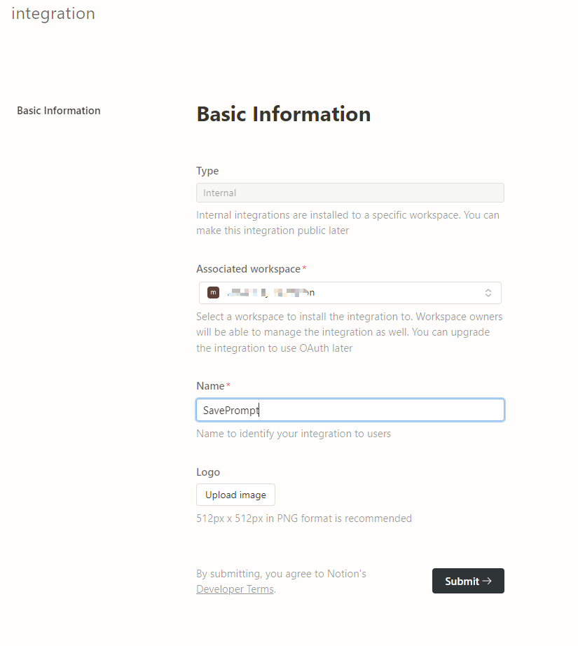
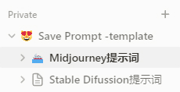
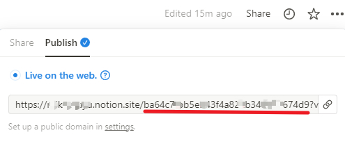

# 将提示词保存到Notion的插件

  
  

    
[toc]

## 功能
将**Midjourney**、**Stable Diffusion** 图片的提示词、以及**其他元数据**信息保存到**notion**。

使用截图

**Midjourney部分**

**Stable Diffuison部分**

## 支持范围
- midjourney 网站
    - https://www.midjourney.com/explore
    - https://www.midjourney.com/imagine

- C站
    - https://civitai.com/

## 安装与使用

### 准备

#### notion API 申请

从页面上申请：https://www.notion.so/my-integrations

步骤：Create new intergration -> 填写信息 -->提交

生成后 复制 **Secrets** 保存备用

#### 拷贝notion模板、记录数据库ID

[模板地址](https://mikotoayu.notion.site/Save-Prompt-template-835950fa263147bda2a2876d2c824f83)

点击模板地址中右上角 **Duplicate**

**保存**到自己账户下后出现在左侧栏如下

**点击** Midjourney提示词页面，有两种方式获取数据库ID

1. 从当前页面的url中获取：https://www.notion.so/username/ba64c7fbb5eb43f4a822b34d081674dx?v=d72a46a9679746a1b9428b6d991f720x

其中你的用户名后面跟的字符串就是：`ba64c7fbb5eb43f4a822b34d081674dx`

2. **点击** Midjourney提示词页面后，点击右上角 Share -> Publish，从链接地址获取

**同理可获取Stable Diffusion页面数据库的ID**

#### 获取 Civitai Api Key （可选）

如不使用 Civitai，则跳过

登录Civitai --> 点击头像 --> Acount seetting --> 拉到最下面 API keys 的位置

添加一个 API key 保存备用

### 安装插件

1. clone 项目自己打包；

   [README_Starter.md]: ./README_Starter.md

2. 从 releases，下载 dist.zip。我自己上传后，再下载Win11报毒，不知道为啥。

安装后填入配置信息，**点击保存设置**

### 使用

在**图片详情页面**，**右击图片**，点击 **save-prompt**

Midjourney例：https://www.midjourney.com/jobs/908e9b27-ae8b-4a7d-a9f8-145ca0efe6cf?index=0

扩展图标出现OK则成功（只出现2s）

Civitai 例：**图片详情页面** **右击图片**

## 限制

### midjourney

midjourney 提供的图片访问地址在notion无法正确加载，疑似midjourney不接受第三方Cookie

### civitai

C站 API key 竟然还没提供根据图片ID查询数据的接口？！（截至 2024-03-13 ）

现只能分页查询，爬的页面上的**发布者ID**和**模型ID**去查，再根据查到的数据和`url`中的**图片ID** 对比筛选出来！！！

默认分页100，如果当前图片的发布者对当前模型发布的图片超过100，就查不到？？(´･ω･`)? 不想改了，等C站接口更新（猴年马月）

## 资源地址

[notion官网](https://www.notion.so/)

[midjourney](https://www.midjourney.com/)

[civitai](https://civitai.com/)
